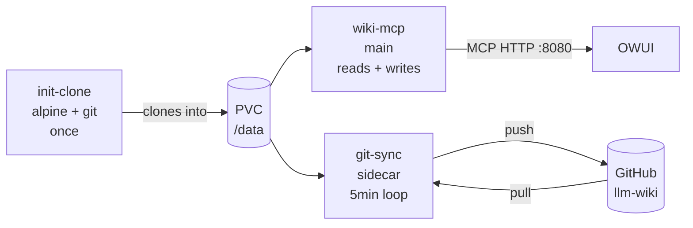

# wiki-mcp (deploy)

Kustomize manifests for the [wiki-mcp](https://github.com/dvystrcil/wiki-mcp-docker)
Go MCP server. Phase 3 of dvystrcil/homelab#211.

## Layout

```
base/
  namespace.yaml             # ambient-mode label for gateway-services
  harbor-pull-secret.yaml    # InfisicalSecret → dockerconfigjson
  github-token-secret.yaml   # InfisicalSecret → PAT for llm-wiki access
  pvc.yaml                   # 1Gi RWO for the working clone
  git-sync-script.yaml       # ConfigMap: init.sh + sync.sh
  deployment.yaml            # init + main + sidecar in one pod
  service.yaml               # ClusterIP :8080
  kustomization.yaml
```

The Argo Application + ImageUpdater CR live in [dvystrcil/argocd-projects](https://github.com/dvystrcil/argocd-projects) under `wiki-mcp/`.

## Pod shape



The `wiki-mcp` container itself has no outbound network — all GitHub
traffic is in the sidecar. The two-container split exists so that if
the GitHub token expires, the MCP keeps serving reads from the local
clone; only sync stops.

## Image tag convention

Pinned to `harbor.sirddail.net/ai/wiki-mcp:<semver>` — matches the
[open-terminal](https://github.com/dvystrcil/open-terminal) pattern.

**Release flow:**

1. Push to `main` of [wiki-mcp-docker](https://github.com/dvystrcil/wiki-mcp-docker) → CI builds `:dev` (mutable) and `:sha-<short>` (immutable debug aid)
2. Cut a GitHub release (e.g. `v0.2.0`) → release workflow retags `:dev` as `:0.2.0`, `:0.2`, and `:latest` in Harbor (no rebuild)
3. Bump the `image:` line in `base/deployment.yaml` here → commit + push → Argo syncs

No ImageUpdater — releases are intentional, gated by an actual GitHub release. The `:dev` tag never appears in this deployment.

## Secrets

Two InfisicalSecret CRs materialize from the `homelab-bz-gt/prod` project:

| K8s Secret               | Infisical keys used                  | Purpose                       |
|--------------------------|--------------------------------------|-------------------------------|
| `wiki-mcp-harbor-pull`   | HB_REGISTRY/USERNAME/PASSWORD/AUTH   | Pull from harbor-core         |
| `wiki-mcp-github-token`  | GITHUB_TOKEN_WIKI_MCP                | sidecar git push/pull         |

`GITHUB_TOKEN_WIKI_MCP` is a fine-grained PAT with `contents:rw` scoped
to `dvystrcil/llm-wiki` only. Rotate via Infisical; the sidecar picks
up the new value on next pod restart.

## License

MIT.
